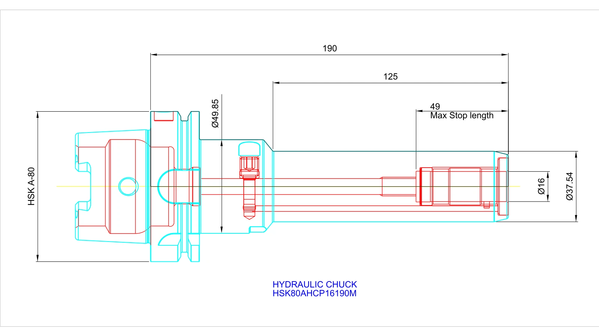

# ACadSharp.Image

[](https://www.nuget.org/packages/ACadSharp.Image)

**High-quality DXF/DWG to image rendering for .NET**, built on top of [ACadSharp](https://github.com/DomCR/ACadSharp) and [SixLabors.ImageSharp](https://github.com/SixLabors/ImageSharp).

`ACadSharp.Image` is an open source renderer for turning CAD drawings into raster images for previews, automation pipelines, documentation, web apps, and CLI workflows.



## Highlights

- Render **DXF** and **DWG** files with ACadSharp
- Export to **PNG**, **BMP**, **JPEG**, **GIF**, and **WebP**
- Control **width**, **height**, **background color**, and **output quality**
- Support **model space**, **paper layouts**, and **viewports**
- Includes a **.NET tool CLI**
- Ships with GitHub Actions for **CI**, **NuGet publishing**, and **native AOT release binaries**

## Repository layout

| Path | Description |
| --- | --- |
| `ACadSharp.Image` | Core rendering library |
| `ACadSharp.Image.Cli` | CLI and .NET tool |
| `ACadSharp.Image.Tests` | Automated tests |
| `Samples` | Example CAD inputs and rendered output |
| `.github/workflows` | CI and release automation |

## Install

### Library package

```bash
dotnet add package ACadSharp.Image
```

### CLI as a .NET tool

```bash
dotnet tool install --global ACadSharp.Image.Cli
```

Update an existing install:

```bash
dotnet tool update --global ACadSharp.Image.Cli
```

## Quick start

### Library usage

```csharp
using ACadSharp.IO;
using ACadSharp.Image;
using SixLabors.ImageSharp;

var document = DwgReader.Read("part.dwg");

var exporter = new ImageExporter("part.webp");
exporter.Configuration.Width = 2000;
exporter.Configuration.Height = 1400;
exporter.Configuration.BackgroundColor = Color.Parse("#ffffff");
exporter.Configuration.OutputQuality = 90;

exporter.AddModelSpace(document);
exporter.Close(ImageExportFormat.Webp);
```

### CLI usage

Render a sample DXF to WebP:

```bash
cad-to-image "./Samples/Subaru Logo Vector Free Wrap.dxf" --format webp --width 1400 --height 1400 --quality 85
```

Render a DWG with a custom background:

```bash
cad-to-image "./Samples/HSK80AHCP16190M_BMG.dwg" --format png --width 1800 --height 1200 --background "#0c0c0c"
```

## CLI reference

```text
Usage:
  cad-to-image <input.dxf|input.dwg> [options]

Options:
  -o, --output <path>         Output file or directory path.
  -f, --format <format>       png, bmp, jpg, jpeg, gif, webp.
  -w, --width <pixels>        Output width in pixels. Default: 1600.
  -H, --height <pixels>       Output height in pixels. Default: 900.
  -b, --background <color>    Background color name or hex value. Default: white.
  -q, --quality <1-100>       Output quality for lossy formats. Default: 90.
      --paper-layouts         Export paper layouts instead of model space.
      --help, -h, -?          Show this help text.
```

## Run locally

From the repository root:

```bash
dotnet restore ACadSharp.Image.sln
dotnet test ACadSharp.Image.sln
dotnet run --project ./ACadSharp.Image.Cli/ACadSharp.Image.Cli.csproj -- "./Samples/HSK80AHCP16190M_BMG.dwg" --format png --width 1800 --height 1200
dotnet run --project ./ACadSharp.Image.Cli/ACadSharp.Image.Cli.csproj -- "./Samples/6-57-1119.dxf" --width 160 --height 80 --hide-layer OPTIONAL_DIMENSIONS
```

Build local NuGet packages:

```bash
dotnet pack ./ACadSharp.Image/ACadSharp.Image.csproj -c Release

dotnet pack ./ACadSharp.Image.Cli/ACadSharp.Image.Cli.csproj -c Release
dotnet tool install -g --add-source ./ACadSharp.Image.Cli/bin/Release ACadSharp.Image.Cli
```

Publish a native AOT CLI binary locally:

```bash
dotnet publish ./ACadSharp.Image.Cli/ACadSharp.Image.Cli.csproj -c Release -r win-x64 --self-contained true -p:PublishAot=true
```

## License

This project is released under the [MIT License](LICENSE).
