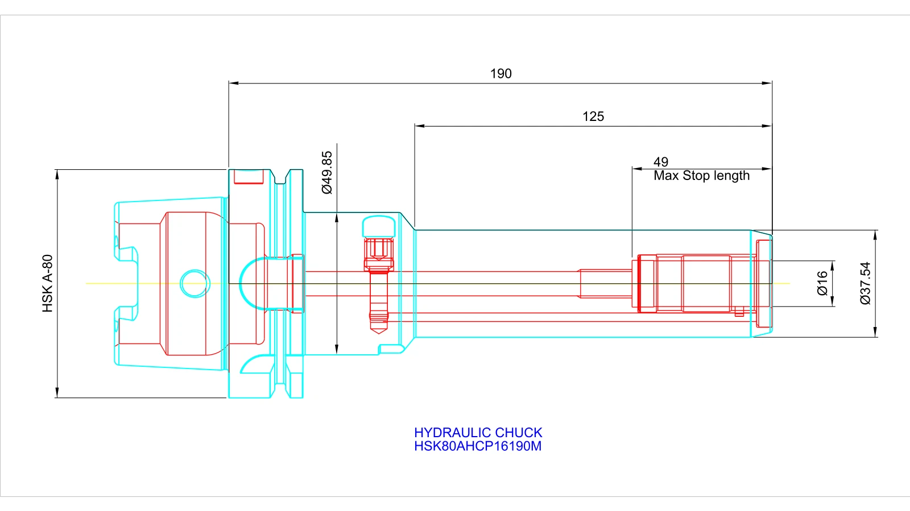

# ACadSharp.Image

[](https://www.nuget.org/packages/ACadSharp.Image)
[](LICENSE)
[](https://dotnet.microsoft.com/download)
[](https://github.com/slaveoftime/ACadSharp.Image/actions)

**High-performance DXF/DWG to image renderer for .NET**, built on [ACadSharp](https://github.com/DomCR/ACadSharp) and [ImageSharp](https://github.com/SixLabors/ImageSharp).

Transform CAD drawings into raster images or SVG for **previews**, **CI/CD pipelines**, **web applications**, **documentation**, and **automated workflows** — with zero AutoCAD dependency.



---

## ✨ Features

- 🎨 **Multi-format export** — PNG, BMP, JPEG, GIF, WebP, and SVG support
- 📐 **Full CAD support** — Render DXF and DWG files with ACadSharp
- 🖼️ **Customizable output** — Control width, height, padding, background color, and quality
- 📊 **Space support** — Model space, paper layouts, and viewports
- 🖋️ **SVG output** — One `<g>` per layer, `data-*` attributes and real `<text>`, ready for React pan/zoom viewers
- 👁️ **Layer visibility modes** — `screen` and `plot` honour off, frozen, non-plottable and viewport-frozen layers
- 🎭 **Layer filtering** — Include and exclude layer lists, with `--hide-layer` and `--only-layer` CLI options
- 〰️ **Linetypes, transparency and hatches** — Dashed linetypes, entity transparency and hatch fills are rendered
- ⚡ **CLI tool** — Cross-platform command-line interface for automation
- 🔧 **Library API** — Full .NET integration with intuitive fluent-style configuration
- 🚀 **Native AOT** - Publish as standalone native binaries with zero .NET runtime requirement
- 📚 **Fully documented** — Complete XML IntelliSense support

---

## 📦 Installation

### NuGet Package

```bash
dotnet add package ACadSharp.Image
```

### CLI as Global Tool

```bash
dotnet tool install --global ACadSharp.Image.Cli
```

**Update to latest version:**

```bash
dotnet tool update --global ACadSharp.Image.Cli
```

---

## 🚀 Quick Start

### Library Usage

Render a DWG file with custom settings:

```csharp
using ACadSharp.IO;
using ACadSharp.Image;
using SixLabors.ImageSharp;

// Load CAD document
var document = DwgReader.Read("part.dwg");

// Configure and export
var exporter = new ImageExporter();
exporter.Configuration.Width = 2000;
exporter.Configuration.Height = 1400;
exporter.Configuration.SetPadding(24, 12);
exporter.Configuration.BackgroundColor = Color.Parse("#ffffff");
exporter.Configuration.OutputQuality = 90;

// Optional: hide specific layers
exporter.Configuration.HideLayer("DIMENSIONS");
exporter.Configuration.HideLayer("ANNOTATIONS");

exporter.AddModelSpace(document);
exporter.Save("./output-directory/filename.webp", ImageExportFormat.Webp);
```

**Multi-page export:**

```csharp
var exporter = new ImageExporter();
exporter.AddPaperLayouts(document);
exporter.Save("./output-directory/filename.png", ImageExportFormat.Png);
```

### CLI Usage

**Basic rendering:**

```bash
cad-to-image "drawing.dxf" --format webp --width 1400 --height 1400 --quality 85
```

**Custom background & dimensions:**

```bash
cad-to-image "part.dwg" --format png --width 1800 --height 1200 --background "#0c0c0c"
```

**Add padding around the drawing:**

```bash
cad-to-image "part.dwg" --format png --padding 24
cad-to-image "part.dwg" --format png --padding 24,12
cad-to-image "part.dwg" --format png --padding 24,12,40,20
```

**Hide multiple layers:**

```bash
cad-to-image "complex.dxf" --hide-layer "DIMENSIONS" --hide-layer "ANNOTATIONS" --hide-layer "BORDER"
```

**Export paper layouts:**

```bash
cad-to-image "multi-sheet.dwg" --paper-layouts --output ./sheets/
```

**Render to SVG:**

```bash
cad-to-image "drawing.dxf" --format svg --layer-visibility plot --only-layer "A-WALL" --only-layer "A-DOOR"
```

**List a drawing's layers:**

```bash
cad-to-image "drawing.dxf" --list-layers
```

---

## 📖 CLI Reference

```
Usage:
  cad-to-image <input.dxf|input.dwg> [options]

Options:
  -o, --output <path>         Output file or directory path.
  -f, --format <format>       png, bmp, jpg, jpeg, gif, webp, svg.
  -w, --width <pixels>        Output width in pixels. Default: 1600.
  -H, --height <pixels>       Output height in pixels. Default: 900.
  -p, --padding <value>       Padding in pixels: <all>, <x,y>, or <left,top,right,bottom>.
  -b, --background <color>    Background color name or hex value. Default: white.
  -q, --quality <1-100>       Output quality for lossy formats. Default: 90.
      --paper-layouts         Export paper layouts instead of model space.
      --hide-layer <name>     Hide entities on the specified layer. Can be used multiple times.
      --only-layer <name>     Render only the specified layer(s). Can be used multiple times.
      --layer-visibility <m>  all (default), screen (honour off/frozen), or plot (also honour non-plottable).
      --list-layers           Print the drawing's layers and exit without rendering.
      --svg-no-scaling-stroke Write SVG stroke widths in drawing units instead of constant pixels.
      --svg-no-entity-attributes
                              Omit data-handle/data-type/data-parent/data-block attributes from SVG.
      --svg-size              Emit width/height on the SVG root from --width/--height.
      --svg-id-prefix <text>  Prefix for SVG ids so several drawings can share one page.
      --svg-precision <0-8>   Decimal places for SVG coordinates. Default: adaptive.
      --help, -h, -?          Show this help text.
```

---

## 🏗️ Architecture

```
ACadSharp.Image/
├── ImageExporter.cs                  # Main public API
├── ImageConfiguration.cs             # Configuration (layers, colours, SVG options)
├── ImagePage.cs                      # Page representation
├── RenderedPage.cs                   # Abstract rendered output (Save to path/stream)
├── RenderedImagePage.cs              # Raster output (ImageSharp)
├── RenderedSvgPage.cs                # SVG output
├── SvgOptions.cs                     # SVG-only settings
├── LayerVisibilityMode.cs            # All / Screen / Plot
├── ImageExportFormat.cs              # Png, Bmp, Jpeg, Gif, Webp, Svg
├── ImageExportFormatExtensions.cs    # Format <-> file extension helpers
└── Rendering/
    ├── IDrawingSurface.cs            # Backend-neutral primitives
    ├── RasterDrawingSurface.cs       # ImageSharp backend
    ├── Svg/
    │   ├── SvgDrawingSurface.cs      # SVG backend
    │   ├── SvgIdSanitizer.cs         # HTML-safe id generation
    │   └── SvgNumberFormatter.cs     # Coordinate formatting/precision
    ├── ImagePageRenderer.cs          # Page-level rendering and viewports
    ├── EntityRenderDispatcher.cs     # Entity routing, layer filtering, hatches
    ├── EntityRenderInfo.cs           # Handle/type/parent/block identity for a drawn entity
    ├── EntityVisibilityFilter.cs     # Include/hide lists and layer state
    ├── ImageStyle.cs                 # Resolved colour, width, dashes, opacity for one entity
    ├── ImageStyleResolver.cs         # Colour, width, dashes, opacity
    ├── LineTypeDashResolver.cs       # Linetype to dash array
    ├── SplineRenderer.cs / SplineBezierConverter.cs
    ├── CurveTessellation.cs          # Arc/circle/ellipse sampling for raster and off-plane entities
    ├── TextRenderer.cs               # Text to SurfaceText
    ├── SurfacePoint.cs               # Surface-space point/rect primitives
    ├── SurfaceText.cs                # Backend-neutral text placement
    └── ImageRenderContext.cs         # Coordinate transforms
```

The library follows a clean architecture pattern:
- **ImageExporter** - Public API for adding CAD content
- **ImagePage** - Represents individual renderable pages
- **Rendering pipeline** - Transforms CAD entities to surface coordinates and draws them through a backend-neutral `IDrawingSurface`, implemented by a raster (ImageSharp) and an SVG surface
- **Configuration** - Fluent, extensible settings for customization

---

## 💡 Advanced Usage

### Layer selection

```csharp
var exporter = new ImageExporter();
exporter.Configuration.IncludeLayers(["A-WALL", "A-DOOR"]);   // render only these (optional)
exporter.Configuration.HideLayer("A-DOOR");                    // then remove one of them
exporter.AddModelSpace(document);
```

Filtering happens when rendering, so it also applies to block contents, dimension geometry and paper-space viewport contents. Entities on layer `0` inside a block take the layer of the insert that placed them, including its colour, line weight and linetype when theirs are ByLayer; ByBlock attributes resolve to the placing insert's own (colour 7 and defaults at top level). Text inside block references is placed through the insert's transform from the original entity, because ACadSharp 3.7.1 leaves TEXT alignment points and MTEXT directions untransformed when exploding. Rendering never modifies the pages, so changing filters between renders is safe.

### Layer visibility

```csharp
exporter.Configuration.LayerVisibility = LayerVisibilityMode.Plot; // All (default), Screen, Plot
```

`Screen` hides off and frozen layers, invisible entities and layers frozen per viewport. `Plot` also hides non-plottable layers such as `DEFPOINTS`. Hidden block attributes and the drawing's ATTMODE are honoured in the same two modes.

### Supported entities

Lines, arcs, circles, ellipses, polylines (2D, 3D, lightweight, with bulges), splines, points, solids, 3D faces (edges, honouring invisible-edge flags), hatches (solid and pattern), TEXT, MTEXT, dimensions, block references, block attributes (ATTRIB; hidden ones follow ATTMODE under `Screen`/`Plot`), leaders (straight and splined, with the default arrowhead), multilines (element offsets, fill, square caps; cuts are not rendered), wipeouts (masked with the background colour; needs an opaque `BackgroundColor`; in SVG the mask stays within layer-group order) and paper-space viewports. Entities, including paper-space viewports, are drawn in the drawing's draw order (handle order overridden by DRAWORDER), so later entities paint over earlier ones (in SVG, within each layer group; layer grouping comes first). Draw order applies to the page's own entities; the contents of a block reference are drawn in the block's stored order. A block reference whose block is missing is skipped with a warning.

### Linetypes, transparency and colour 7

Dashed linetypes are rendered using `LTSCALE`, the entity linetype scale and `PSLTSCALE` (honoured from the raw `$PSLTSCALE` header value) in paper space; patterns shorter than `MinimumDashPixels` are drawn solid (pixel-width modes only; not applied in SVG drawing-unit mode), and embedded shapes and text in a linetype render as gaps. Entity transparency becomes opacity (ByLayer is treated as opaque because the ACadSharp layer table carries no transparency). Colour index 7 resolves to black or white from the background luminance, or to `ForegroundColor` when set.

### SVG output

```csharp
exporter.Configuration.Svg.NonScalingStroke = true;      // constant on-screen stroke width when zooming (default)
exporter.Configuration.Svg.IdPrefix = "plan1-";           // when inlining several drawings in one page
exporter.Save("plan.svg", ImageExportFormat.Svg);
```

The SVG has a drawing-unit `viewBox`, no `width`/`height` unless `Svg.EmitSize` is set, an attribute-free `<g class="cad-root">` for your pan/zoom transform, and one `<g data-layer="...">` per layer. Every element carries `data-handle` and `data-type` (plus `data-parent`/`data-block` for block contents); `data-handle` is omitted for exploded block contents, since they are transient clones with no handle of their own. In React, prefer injecting the markup at runtime or configure SVGO to keep ids; `data-*` attributes survive the default SVGR pipeline. Toggle a layer with CSS `display: none` on its group.

SVG and PNG are built from the same geometry and never disagree on it, but they intentionally differ in fidelity: SVG keeps native arcs, Beziers and `<text>`, while raster output tessellates curves and outlines glyphs. SVG text is sized and wrapped to match the PNG output; glyph shapes still depend on the viewer's fonts. `ImageConfiguration.Dpi` affects only line weights; text is sized from the drawing on both backends. Entities with a non-world extrusion normal (an OCS other than the default) are brought into world coordinates first: arcs, circles and ellipses through ACadSharp's own tessellation, polylines, hatches and solids through the renderer's OCS transform. Single-line TEXT on another plane is placed on the mirrored extent with readable glyphs; AutoCAD would draw the glyphs themselves mirrored, so this is a deliberate readability choice, not a parity guarantee. Text height follows the projected up direction, so text on a tilted plane is foreshortened. MTEXT and dimension geometry are already world coordinates in DXF; MTEXT is placed through the same projection (its height follows the projected X-axis length) and dimensions need no transform. The available `Svg` options are `NonScalingStroke`, `EmitEntityAttributes`, `EmitSize`, `IdPrefix`, and `Precision`.

### Custom Line Weights

Override default line weight values:

```csharp
exporter.Configuration.SetLineWeight(LineWeightType.W25, 0.30);
exporter.Configuration.LineWeightScale = 1.5f; // Scale all weights
```

### Text & Font Configuration

Customize text rendering:

```csharp
exporter.Configuration.FontFamilyName = "Consolas";
exporter.Configuration.ArcPrecision = 512; // Higher = smoother arcs
```

---

## 🛠️ Development

### Prerequisites

- [.NET 8.0 SDK](https://dotnet.microsoft.com/download) or later
- Any IDE with C# support (VS 2022, VS Code, Rider)

### Build & Test

```bash
# Clone and build
git clone https://github.com/slaveoftime/ACadSharp.Image.git
cd ACadSharp.Image
dotnet restore
dotnet build
dotnet format --verify-no-changes

# Run tests
dotnet test
```

### Measure Render Performance

Use the repeatable sample-render benchmark script:

```powershell
powershell -ExecutionPolicy Bypass -File .\artifacts\measure-render.ps1
powershell -ExecutionPolicy Bypass -File .\artifacts\measure-render.ps1 -Iterations 10
```

### Run Examples

```bash
dotnet run --project ./ACadSharp.Image.Cli/ACadSharp.Image.Cli.csproj -- "./Samples/6-57-1119.dxf" --width 300 --height 200 --hide-layer OPTIONAL_DIMENSIONS

dotnet run --project ./ACadSharp.Image.Cli/ACadSharp.Image.Cli.csproj -- "./Samples/HSK80AHCP16190M_BMG.dwg" --format webp --width 1200 --height 760

dotnet run --project ./ACadSharp.Image.Cli/ACadSharp.Image.Cli.csproj -- "./Samples/Subaru Logo Vector Free Wrap.dxf" --format webp --width 1200 --height 700 --background "#a0a7ae"

dotnet run --project ./ACadSharp.Image.Cli/ACadSharp.Image.Cli.csproj -- "./Samples/6-57-1119.dxf" --format svg --layer-visibility plot
```

### Build NuGet Package

```bash
dotnet pack ./ACadSharp.Image/ACadSharp.Image.csproj -c Release
dotnet pack ./ACadSharp.Image.Cli/ACadSharp.Image.Cli.csproj -c Release
dotnet tool install -g --add-source ./ACadSharp.Image.Cli/bin/Release ACadSharp.Image.Cli
```

### Publish Native Binary (AOT)

Zero-dependency standalone executables:

```bash
# Windows x64
dotnet publish ./ACadSharp.Image.Cli/ -c Release -r win-x64 --self-contained -p:PublishAot=true

# Linux x64
dotnet publish ./ACadSharp.Image.Cli/ -c Release -r linux-x64 --self-contained -p:PublishAot=true

# macOS ARM64
dotnet publish ./ACadSharp.Image.Cli/ -c Release -r osx-arm64 --self-contained -p:PublishAot=true
```

---

## 🔄 Migration Notes

Recent modernization work includes intentional API tightening:

- `ImageExporter.Pages` is now a read-only collection view.
- `ImagePage.Entities` and `ImagePage.Viewports` are now read-only collection views.
- Add content through `ImageExporter.Add(...)`, `ImagePage.Add(...)`, `ImagePage.AddEntity(...)`, and `ImagePage.AddViewport(...)`.
- `ImageConfiguration.HiddenLayers` is now read-only; use `HideLayer`, `HideLayers`, `ShowLayer`, and `ClearHiddenLayers`.
- `ImageConfiguration.LineWeightValues` is now read-only; use `SetLineWeight`, `RemoveLineWeight`, and `ClearLineWeights`.

These changes preserve the rendering behavior while making mutation points explicit and easier to maintain.

Changes on the way to the next major release:

- `ImageExporter.Render()` now takes an optional `ImageExportFormat` and returns `IReadOnlyList<RenderedPage>`; cast items to `RenderedImagePage` for the raster canvas or `RenderedSvgPage` (its `Content` holds the markup), or call `Save(path)`/`Save(stream)` on the page.
- `RenderedImagePage` derives from the new abstract `RenderedPage` and its constructor takes the format and quality it will save with.
- The library targets net8.0 and net10.0; net6.0 is no longer supported.
- ACadSharp 3.7.1 is required.
- `ImagePage.Entities` now keeps every added entity; `ImageConfiguration.HiddenLayers` and `LayerVisibility` are applied at render time instead of at `Add`, so changing them afterwards takes effect, and the framing of auto-sized pages follows the currently visible entities.
- New public members: `ImageConfiguration.GetLineWeightMillimeters` and `ImagePage.Document`.
- `RenderedImagePage.Save` throws `NotSupportedException` when its format is `ImageExportFormat.Svg`; use a `RenderedSvgPage` for SVG output instead.
- `ImagePage.Entities` is now ordered by the drawing's draw order (handle order, overridden by DRAWORDER) instead of file order, so later entities paint over earlier ones; block contents keep their stored order.
- `ImageConfiguration.Dpi` no longer scales text; it affects only line weights. Raster text is laid out at a fixed 72 dpi from the same em size the SVG backend uses, so PNG text at the default 96 dpi is unchanged.
- Release this work under a major version tag (for example `v2.0.0`); the version is derived from the tag by the release workflow.

---

## 🤝 Contributing

Contributions are welcome! Please feel free to submit a Pull Request.

1. Fork the repository
2. Create your feature branch (`git checkout -b feature/amazing-feature`)
3. Commit your changes (`git commit -m 'Add amazing feature'`)
4. Push to the branch (`git push origin feature/amazing-feature`)
5. Open a Pull Request

---

## 📄 License

This project is released under the [MIT License](LICENSE).

---

## 🌟 Support

If you find this project helpful, please consider giving it a ⭐️ on GitHub! It helps others discover the project.

**Questions or issues?** [Open an issue](https://github.com/slaveoftime/ACadSharp.Image/issues) or start a [Discussion](https://github.com/slaveoftime/ACadSharp.Image/discussions).
